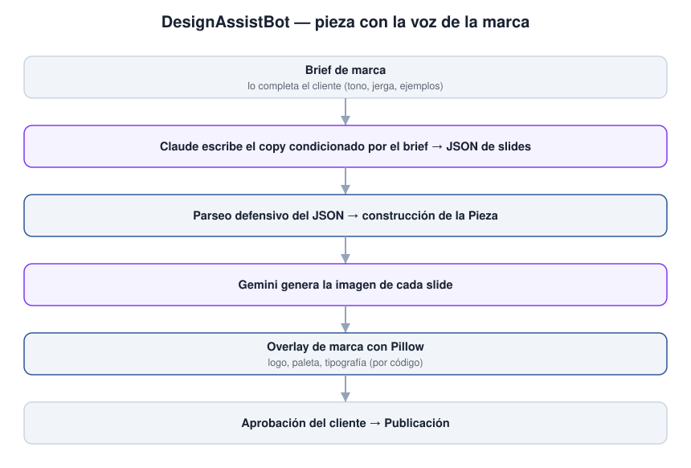

**🇦🇷 Español · 🇬🇧 [English](#-english)**

# DesignAssistBot

> Asistente que genera carruseles, historias y posts de Instagram con la voz de cada marca, no con la voz genérica de una IA.

**Este repositorio es una vitrina técnica, no el sistema.** El sistema en
producción es privado. Acá están la arquitectura, las decisiones de diseño y
algunos fragmentos de código elegidos para mostrar cómo está resuelto.

---

## El problema

Un community manager necesita publicar seguido y con una voz consistente. Las
herramientas de IA generan texto correcto pero plano: suena a IA, no a la marca,
y el cliente no lo publica. Y la imagen que devuelven no respeta el logo ni la
paleta de la cuenta.

DesignAssistBot arma la pieza completa desde un brief de marca que completa el
cliente: el modelo escribe el copy condicionado por ese brief, se genera la
imagen, y la identidad visual (logo, paleta, tipografía) se aplica por código
por encima — no se le pide al modelo, porque no reproduce un logo de forma
consistente.

## Arquitectura



```
Brief de marca (lo completa el cliente: tono, jerga, ejemplos reales)
      │
      ▼
Claude escribe el copy condicionado por el brief  ──►  JSON de slides
      │                                                     │ parseo defensivo
      ▼                                                     ▼
Generación de imagen (Gemini)  ──►  overlay de marca (Pillow: logo, paleta, fuente)
      │
      ▼
Pieza (carrusel / historia / post)  ──►  aprobación humana  ──►  publicación
```

Detalle en [`docs/arquitectura.md`](docs/arquitectura.md).

## Stack

| Capa | Tecnología | Por qué esta y no otra |
|---|---|---|
| Backend | Python · FastAPI | Async para la cola de generación |
| Base de datos | PostgreSQL sobre Supabase | Config por cuenta + Storage de imágenes |
| Interfaz | Jinja2 · Tailwind · Chart.js | Panel de 20 vistas con métricas de Instagram |
| Texto | Claude | Copy en la voz de la marca, routing por tarea |
| Imagen | Gemini + Pillow | El modelo genera; Pillow aplica la identidad |
| Despliegue | Render | — |

## Decisiones de diseño

Detalle en [`docs/decisiones.md`](docs/decisiones.md).

### El brief de marca lo completa el cliente antes de generar nada

- **Qué se hizo:** un cuestionario estructurado (tono, jerga, palabras prohibidas, ejemplos reales de captions propios). Ver [`docs/brief_de_marca.md`](docs/brief_de_marca.md).
- **Alternativa descartada:** que el modelo infiera la voz de la marca desde el feed.
- **Por qué:** sin brief, el output suena a IA genérica y el cliente no lo publica.
- **Qué costó:** fricción en el onboarding — hay que perseguir al cliente para que lo llene.

### La identidad visual se aplica con Pillow, no se le pide al modelo

- **Qué se hizo:** logo, paleta y tipografía se superponen por código sobre la imagen generada.
- **Alternativa descartada:** pedirle al generador de imágenes que incluya el logo.
- **Por qué:** el modelo no reproduce un logo de forma consistente — lo deforma o lo reinventa.
- **Qué costó:** menos libertad de composición; el overlay es más rígido.

## Decisiones sobre este repositorio

- **Es una vitrina, no un espejo.** El sistema en producción tiene material de
  clientes: nombres de marca, cuentas de Instagram, captions reales. No es publicable entero.
- **Se publica lo que se lee.** Tres fragmentos elegidos, uno por decisión, más
  el brief de marca en blanco como artefacto de producto.
- **Este proyecto no tiene suite de tests.** Se dice acá en vez de improvisar
  una para la vitrina. La calidad se apoya en la documentación del pipeline.
- **Los nombres de cliente están reemplazados** por ficticios, no ofuscados.

## Qué hay en este repositorio

| Carpeta | Qué contiene |
|---|---|
| [`docs/`](docs/) | Arquitectura, decisiones, el brief de marca y capturas |
| [`snippets/`](snippets/) | Tres fragmentos comentados, uno por decisión |

Los fragmentos de `snippets/` no forman un programa ejecutable: están para leerse.

## Escala del proyecto

Panel propio de 20 vistas con análisis semanal de métricas de Instagram.
Entregado a un cliente entre mayo y junio de 2026.

## Estado

Entregado. Repositorio de producción privado.

---

## Código completo

El repositorio de producción es privado porque contiene material de clientes.
Puedo dar acceso de lectura durante un proceso de selección: escribime a
**mario1804.dev@gmail.com**.

## Licencia

Todos los derechos reservados. Ver [`LICENSE`](LICENSE).

---

<a name="english"></a>
# 🇬🇧 English

# DesignAssistBot

> Assistant that generates Instagram carousels, stories and posts in each brand's own voice, not an AI's generic voice.

**This repository is a technical showcase, not the system.** The production
system is private. Here you'll find the architecture, the design decisions and a
few code snippets chosen to show how it's built.

## The problem

A community manager needs to publish often and with a consistent voice. AI tools
generate correct but flat text: it sounds like AI, not like the brand, and the
client won't publish it. And the image they return respects neither the logo nor
the account's palette.

DesignAssistBot builds the whole piece from a brand brief the client fills in:
the model writes the copy conditioned by that brief, the image is generated, and
the visual identity (logo, palette, typography) is applied on top by code — not
asked of the model, because it doesn't reproduce a logo consistently.

## Architecture


Full detail in [`docs/arquitectura.md`](docs/arquitectura.md).

## Stack

| Layer | Technology | Why this and not another |
|---|---|---|
| Backend | Python · FastAPI | Async for the generation queue |
| Database | PostgreSQL on Supabase | Per-account config + image Storage |
| Interface | Jinja2 · Tailwind · Chart.js | 20-view panel with Instagram metrics |
| Text | Claude | Copy in the brand's voice, per-task routing |
| Image | Gemini + Pillow | The model generates; Pillow applies the identity |
| Deployment | Render | — |

## Design decisions

Full detail in [`docs/decisiones.md`](docs/decisiones.md).

### The brand brief is filled in by the client before generating anything

- **What:** a structured questionnaire (tone, slang, forbidden words, real examples of the client's own captions). See [`docs/brief_de_marca.md`](docs/brief_de_marca.md).
- **Rejected alternative:** have the model infer the brand voice from the feed.
- **Why:** without a brief, the output sounds like generic AI and the client won't publish it.
- **Cost:** onboarding friction — you have to chase the client to fill it in.

### Visual identity is applied with Pillow, not asked of the model

- **What:** logo, palette and typography are overlaid by code on the generated image.
- **Rejected alternative:** ask the image generator to include the logo.
- **Why:** the model doesn't reproduce a logo consistently — it warps or reinvents it.
- **Cost:** less compositional freedom; the overlay is more rigid.

## Decisions about this repository

- **It's a showcase, not a mirror.** The production system holds client material: brand names, Instagram accounts, real captions. Not publishable whole.
- **What's published is what reads.** Three chosen fragments, one per decision, plus the blank brand brief as a product artifact.
- **This project has no test suite.** Said here instead of improvising one for the showcase. Quality rests on the pipeline documentation.
- **Client names are replaced** with fictional ones, not obfuscated.

## What's in this repository

| Folder | Contents |
|---|---|
| [`docs/`](docs/) | Architecture, decisions, the brand brief and screenshots |
| [`snippets/`](snippets/) | Three commented fragments, one per decision |

The `snippets/` fragments don't form a runnable program: they're meant to be read.

## Project scale

Purpose-built 20-view panel with weekly Instagram metrics analysis. Delivered to
a client between May and June 2026.

## Status

Delivered. Production repository private.

## Full code

The production repository is private because it contains client material. I can
grant read access during a hiring process: write me at **mario1804.dev@gmail.com**.

## License

All rights reserved. See [`LICENSE`](LICENSE).
